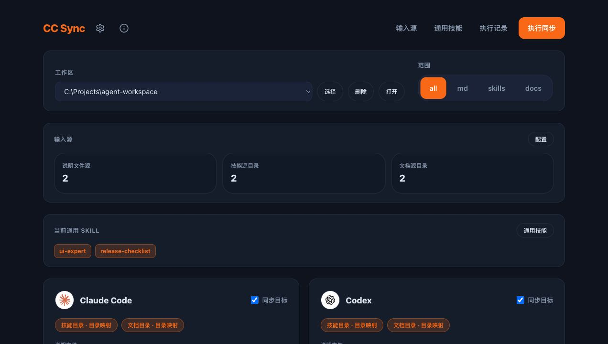

# CC Sync

<div align="center">

### Keep `CLAUDE.md`, `AGENTS.md`, `GEMINI.md`, skills and docs in sync across coding agents.

[](https://github.com/NeoRrrr/cc-sync/releases)
[](https://github.com/NeoRrrr/cc-sync/releases)
[](https://tauri.app/)
[](https://github.com/NeoRrrr/cc-sync/releases/latest)
[](LICENSE)

[下载最新版](https://github.com/NeoRrrr/cc-sync/releases/latest) · [快速开始](#快速开始) · [FAQ](#faq) · [License](#license) · [English Summary](#english-summary)

</div>



CC Sync 是一个本地桌面同步工具，用来把项目里的 Agent 说明文件、skills 和 docs 统一成一份输入源，再同步到 Claude Code / Codex / Gemini 等目标目录。

如果你同时使用多个 coding agent，通常会遇到这样的漂移：

- Claude Code 读 `CLAUDE.md`，Codex 读 `AGENTS.md`，Gemini 读 `GEMINI.md`。
- 每个工具的 skills / docs 目录不一样，手动复制后很快不知道哪份才是最新。
- 团队沉淀下来的项目规则、排查手册、工作流 skill，换一个 Agent 就要重新整理。

CC Sync 的目标很窄：**一处维护，多端同步**。它不管理 API provider，也不替你改模型配置；它只专注让项目知识资产在多个 Agent 之间保持一致。

## 为什么需要它

| 场景 | 没有 CC Sync | 使用 CC Sync |
| --- | --- | --- |
| 项目说明 | 手动维护 `CLAUDE.md` / `AGENTS.md` / `GEMINI.md` 多份文件 | 多个 Markdown 源按顺序合并，再同步到各目标文件 |
| skills | 在 `.claude/skills`、`.codex/skills`、`.gemini/skills` 之间复制 | 从统一技能源目录同步，可按目标追加或排除 |
| docs | 排查手册和运行说明散落在多个目标目录 | docs 源按名称去重，同步到各 Agent docs 目录 |
| 安全性 | 容易把源目录和目标目录配成嵌套路径 | 执行前 dry-run 预览，并阻止危险路径关系 |
| 长期维护 | 改一处忘一处，Agent 理解项目不一致 | 改一次，所有启用目标一起更新 |

## 核心功能

- **多 Markdown 源合并**：按配置顺序合并项目说明，再输出为 `CLAUDE.md`、`AGENTS.md`、`GEMINI.md` 等目标文件。
- **skills 同步与组合**：支持通用 skill、目标额外 skill、目标排除 skill；同名 skill 保留第一个来源并在预览中提示。
- **docs 同步与去重**：同步每个 docs 源目录下的直接子项，同名文档保留第一个来源。
- **三种同步模式**：skills/docs 可分别选择目录映射（junction）、符号链接（symlink）或复制。
- **安全预览**：执行前生成计划；存在错误时不写盘。
- **本地优先**：同步逻辑由本地 Python 引擎执行，配置与状态文件保存在本机。
- **桌面 GUI + CLI 验证**：日常用界面操作，排查时可直接跑 `sync_agents.py --dry-run --json`。

## 适合谁

- 同时使用 Claude Code、Codex、Gemini 的个人开发者。
- 想把项目级 prompt、skills、docs 作为长期资产沉淀的团队。
- 维护多个项目工作区，希望每个项目都有一致 Agent 上下文的人。
- 不想再靠手动复制同步 `.claude`、`.codex`、`.gemini` 目录的人。

## 快速开始

### 下载运行

从 [Releases](https://github.com/NeoRrrr/cc-sync/releases/latest) 下载最新版。

Windows 便携包是自包含的，保持整个文件夹完整，双击 `CC Sync.exe` 即可启动：

```text
CC Sync/
├─ CC Sync.exe
├─ cc-sync.config.json
├─ sync_agents.py
├─ sync_config.py
├─ sync_from_claude.py
├─ python\
└─ README.txt
```

不要只复制 `CC Sync.exe`。内嵌 Python、同步脚本和配置文件必须和 exe 放在同一目录。

macOS 包可从 release 页面下载，源码构建见下方命令。

### 第一次使用

1. 打开 CC Sync，选择要同步的项目工作区。
2. 添加一个或多个说明文件源，例如项目级 Agent 说明。
3. 先只启用一个目标，例如 Codex。
4. 点击「执行同步」，先看预览计划。
5. 确认 md、skills、docs 的数量和目标路径正确后，再确认写盘。
6. 再逐步加入 skills 源、docs 源和其他目标。

建议第一次不要同时打开所有目标，先用一个目标验证路径和预览结果。

## 同步模型

配置文件使用 v3 结构：

- `sources.md_files`：多个说明文件，按配置顺序合并到目标说明文件。
- `sources.skills_dirs`：多个技能源目录，只接受包含 `SKILL.md` 的直接子目录。
- `sources.docs_dirs`：多个文档源目录，读取每个源目录下的直接子项。
- `sync.targets`：当前启用的同步目标，例如 Codex、Gemini、Claude Code。
- `endpoints.*.skills_mode` / `endpoints.*.docs_mode`：技能目录和文档目录可以分别选择目录映射、符号链接或复制。

skills 和 docs 都按名称去重。同名项保留第一个输入源，后续重复项会在同步预览里提示并忽略。

### 说明文件替换

把 md 同步到 Codex/Gemini 时，`replacements` 里的规则会对合并后的正文做**全文字面替换**，例如：

- `.claude` -> `.codex`
- `Claude Code` -> `Codex`
- `CLAUDE.md` -> `AGENTS.md`

这会影响正文、代码块和 URL 中的所有匹配文本。如果正文里有不想被替换的字面量，需要单独留意。

### Windows 链接权限

symlink 模式在 Windows 上需要开启「开发者模式」或以管理员身份运行。权限不足时会自动降级为复制，并在同步预览和结果里提示。

junction 不需要特权，但只能链接目录；文件类 docs 如果要真正链接，只能使用 symlink。

## 安全边界

同步前会先生成预览。存在错误时不会执行写盘操作。

路径检查会阻止以下危险情况：

- source path 等于 target path。
- target path 位于 source path 内部。
- source path 位于 target path 内部。

CC Sync 会在配置文件同目录维护 `cc-sync.state.json`，记录上一次由自己写入过的 skills/docs。后续如果从配置里取消某个已管理项，只会移除状态文件中记录过、且当前没有被手动改动的项；目标目录里手动添加的内容不会被清理。

## 什么内容值得同步

- 项目级 Agent 约定、常用命令、验证方式。
- 日志查询、数据排查、复现回放类 skill。
- 发布、测试、代码审查、问题定位工作流。
- 业务模块说明、排查手册、运行说明。
- 团队已经反复验证过、值得跨 Agent 复用的上下文资产。

建议把稳定复用内容放进共享输入源，把只对某个 Agent 有用的内容放进目标额外 skill。

## 源码开发

macOS / Linux：

```bash
cd cc-sync
./run.sh
```

Windows：

```powershell
cd cc-sync
.\run.bat
```

等价的手动命令：

```powershell
cd cc-sync
npm install
npm run tauri:dev
```

## 构建

Windows 便携包：

```powershell
cd cc-sync
npm install
npm run tauri:build
.\build-portable.ps1
```

打包结果：

```text
portable-dist\CC Sync\
portable-dist\CC Sync portable.zip
```

macOS：

```bash
cd cc-sync
npm install
./build-macos.sh
```

打包结果：

```text
release-assets/
├─ CC.Sync_*_*.dmg
├─ CC.Sync_*_*.app.zip
└─ SHA256SUMS-macos-*.txt
```

macOS 包会把同步脚本作为 Tauri resources 打进 `.app`，首次配置默认保存到：

```text
~/Library/Application Support/CC Sync/cc-sync.config.json
```

## 命令行验证

在源码仓库里验证：

```powershell
python -m py_compile sync_config.py sync_agents.py sync_from_claude.py
npm run build
cd src-tauri
cargo check
```

如果本地有真实配置，还可以先跑 dry-run：

```powershell
python .\sync_agents.py --config .\cc-sync.config.json --scope all --dry-run --json
```

在便携目录里验证：

```powershell
.\python\bin\python.exe .\sync_agents.py --config .\cc-sync.config.json --scope all --dry-run --json
```

常用检查：

```powershell
.\python\bin\python.exe .\sync_agents.py --config .\cc-sync.config.json --list-skills --json
.\python\bin\python.exe .\sync_agents.py --config .\cc-sync.config.json --scope md --target codex --dry-run --json
```

## FAQ

### CC Sync 会帮我切换 API provider 吗？

不会。CC Sync 专注同步项目说明、skills 和 docs。模型、provider、账号、MCP server 等配置不在它的核心范围内。

### 少同步一些 skill 能省上下文吗？

通常不是重点。Claude Code 对技能 / MCP 是按需加载的，所以 CC Sync 的核心价值是维护一致性，而不是省 token。少点上下文噪音至多算顺带收益。

### 会覆盖我手动放到目标目录里的文件吗？

默认不会清理未被 CC Sync 管理过的手动文件。它通过 `cc-sync.state.json` 记录自己写入过的 skills/docs，取消配置时只清理状态文件里记录过、且未被手动改动的项。

### 为什么需要 dry-run？

同步工具最怕路径配错。dry-run 会先展示写入、复制、链接、跳过、警告和错误，让你确认计划后再真正写盘。

### `sync_from_claude.py` 还能用吗？

可以，但它只是旧入口兼容 wrapper。新行为以 `sync_agents.py` 为准。

## English Summary

CC Sync is a local desktop GUI for keeping project-level agent docs, skills and docs consistent across Claude Code, Codex and Gemini.

It turns multiple Markdown files, skill folders and docs folders into one maintainable input set, then syncs them to the agent targets you enable. It is not an API provider switcher; it focuses on local project knowledge assets.

## License

CC Sync is released under the [MIT License](LICENSE).

## Star History

[](https://www.star-history.com/#NeoRrrr/cc-sync&Date)
